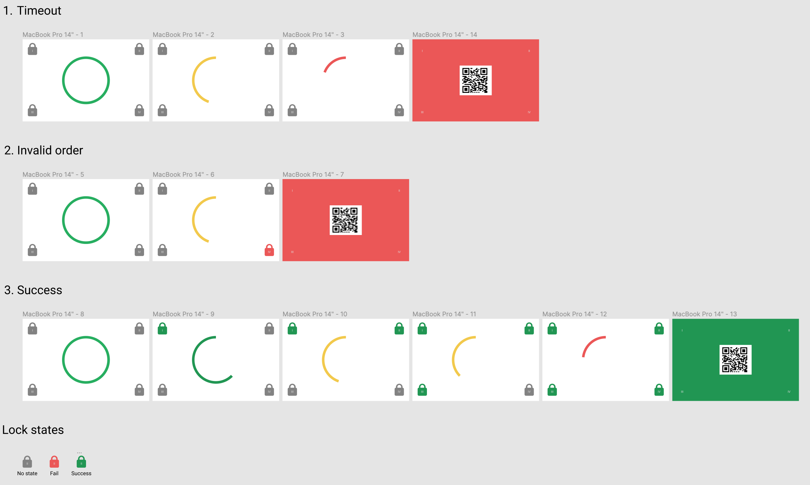

# Phygital gifting

A pretentious and overly scholar way to define what goes into making a gift, other than actually obtaining the gift itself, is to describe the activities associated with the lifecycle of a gift.

Assuming that "thing" that's being gifted is in order, I would argue that there are three distinct phases in the lifecycle of a gift:

1. Wrapping
2. Greeting note
3. Unwrapping

## 1. Wrapping

Wrapping the gift is the first and most essential step for a "thing" to be considered a gift. Only dummies give gifts that isn't wrapped, and by wrapped I mean concealed. A ribbon around the neck of a wine bottle won't make the cut, and is a cheap way to hide your inability to wrap gifts properly. I'll call this _"pseudo wrapping"_, which brings me to my next point: Poor wrapping.

I define a poor wrapping as a wrapping in which the paper may be overly crumbled, cracked, or torn. The folding may be severely misaligned, the ribbon may lack sufficient _"curling"_ or the classic _"tape-all-over-the-place"_ approach has been used (See figure 1).

<figure>

<figcaption align="center"><b>Fig. 1: Poorly wrapped gift</b></figcaption>

</figure>

Receiving a poorly wrapped gift may be even worse than receiving a pseudo wrapped gift. A well-executed wrap-job is therefore paramount to the success of any gift-opening séance. However, most people have a predisposition for poor wrapping skills and actions need to be taken in order to ensure satisfactory gifts are maintained.

## 2. Greeting note

The greeting note is also a crucial step of the gift-giving process, and let's people know who is the poor receiver of your monstrosity. Since the mid-2000s, 90 % of earths population had written their last sentence with pen and paper [Citation needed]. This results in a collective handwriting skill deficit, and every year, 27 million gifts are given to the incorrect receiver because of poor handwriting. This can not continue.

## 3. Unwrapping

The unwrapping phase is the most excruciating of the three, and is usually drawn out by the receiver of the gift to come up with a clever response to cover up their discontent for their new "thing". This phase need to be accelerated, and there needs to be a distraction in place to alleviate the gift-receiver from all the attention.

## Conclusion

There are three main issue that need to be resolved in regard to gifting:

1. Satisfactory wrapping for everyone, everywhere.
2. Understandable greeting notes.
3. Removing unwrapping discomfort.

## The solution

**Phygital gifting** - an ugly word for a physical, as well as digital medium.

> Phygital (physical plus digital) is a marketing term that describes blending digital experiences with physical ones.

The idea is that a digital gifting process may solve all the issues stated above. The process is still physical in the sense that we require an _entry_ to the digital domain, as well as an exit back to the physical domain.

In this repo, I will outline one possible approach for phygital gifting, although there are a plethora of ways this can be done.

### The entry

The entry will be a QR-code, which is the easiest way to allow a user to enter the digital domain. Furthermore, this allows us to bypass the first and second issue of gifting, wrapping and greeting note. Well, sort of. We still have to make a note, but we don't need to use our poor handwriting

The QR-code has to be scanned using a device that support QR-scanning (duh), and is common in most modern smartphones. The QR will lead the user to the receiver part of the web-service.

### The web service

The digital domain consists of a web-service which serve as the wrapping phase along with a distraction from the unwrapping discomfort. The web service contains a number of "nodes", which are just QR-codes that has to be scanned in order to reveal where the gift is hidden (concealed). In this implementation, which has an emphasis on the _puzzle_ part (3. Removing discomfort) of the gifting process. The web-service consists of five main components:

1. Master view
2. Admin page
3. Puzzle node
4. Receiver controller
5. Solution page

#### Master view

The master view provides an interface that reveal all the puzzle nodes as well as audible and visual hints (See figure 2). When all the puzzles are completed within the given timeframe, the QR-code to the solution-page is revealed.

<figure>

<figcaption align="center"><b>Fig. 2: Master view</b></figcaption>

</figure>

#### Admin page

The admin page lies at the root of the web-service, and provides an interface to manage the process. On this page, the user may either set up new nodes, or enter the master view.

#### Puzzle node

The puzzle nodes consist of a QR and may exist both in the physical and digital domain. In this implementation, the puzzle nodes are physical, as it provides for a more robust solution. In the physical implementation, the receiver controller alerts the user whether the scan was successful or not, whereas if it is a digital puzzle node, the node itself could display this information (See figure 3).

<figure>

<figcaption align="center"><b>Fig. 3: Puzzle nodes</b></figcaption>

</figure>

#### Receiver controller

The receiver controller is not really a part of the web-service, but rather pertain to the device used for scanning. Each of the puzzle nodes will direct the user to the master view when scanned, providing an overview of the progress.

#### Solution page

The solution page can display anything you'd like. In my case, it displays a final hint as the where the actual, physical gift is hidden.

## Architecture

TODO: Clean up and finish this section

1. Use firebase with firestore as pubsub service
2. Put everything in a phygital collection
